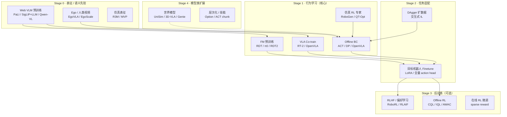

# 机器人 VLA · 训练范式全景图

> **范围**：不限于模仿学习（IL）——涵盖 **IL、RL、VLA 预训练、Co-training、RL 后训练、世界模型** 等全部主流 **训练范式**。  
> **互补文档**：[IL 范式与阅读顺序](./paper-note/IL-Paradigms/概述.md)（IL 子集深度版）· [训练与数据全貌](./VLA训练与数据全貌-深度版.md) · [数采管线](./数采到VLA训练-数据管线整体方案.md)  
> **预计通读**：1.5–2 小时建立地图；按文末阅读顺序精读 8–10 周。

---

## 一、一句话：现代 VLA 训练 = 多层范式叠加

```text
绝大多数「VLA 论文」表面上是 BC，
底层往往是：VLM 预训练 + 机器人 BC +（可选）Web Co-train +（可选）RL/偏好后训练
```

**没有哪一种范式单独通吃**——工业界典型 Recipe 是 **Data Pyramid + 分阶段训练**：

```text
Stage 0  表征预训练     Web VLM / Ego 视频 / 互联网视觉-语言
Stage 1  行为预训练     大规模 robot BC（OXE / UMI / 私有 teleop）
Stage 2  任务微调       目标机器人 50–500 demo BC 或 LoRA
Stage 3  后训练（可选）  Offline RL / RLHF / 在线纠错 / DAgger 扩数据
Stage 4  部署闭环       Chunk 执行 + 低频 re-infer
```

---

## 二、四条正交轴（读任何论文前先定位）

```text
轴 1 · 学习信号从哪来（Supervision Source）
  Demo 监督 ── Reward 监督 ── 偏好/排名 ── 自监督（无 action label）

轴 2 · 是否与环境交互（Interaction）
  Offline（纯数据集）── Online（rollout 采数据）── Hybrid

轴 3 · 动作怎么输出（Action Head）           ← IL-Paradigms 文档重点
  回归 / CVAE / 离散 Token / Diffusion / Flow / 混合

轴 4 · 模型怎么组织（Architecture Stage）
  单策略网络 ── VLM+Action Expert ── FM 预训练+微调 ── 世界模型+规划
```

**IL 只覆盖轴 1 的「Demo 监督」+ 轴 2 的 mostly Offline。**  
**RL 改的是轴 1（Reward）和轴 2（Online/Hybrid）。**  
**VLA 还要加上轴 4 的 VLM 底座与 Co-train。**

---

## 三、训练范式全景图（主图）



---

## 四、主要训练范式速查表

| # | 范式 | 监督信号 | 交互 | 代表 | 本地笔记 |
|:-:|------|----------|:----:|------|---------|
| **A. 模仿学习（IL）** |
| A1 | **Behavior Cloning (BC)** | Demo action | Offline | ACT, DP, RT-1, OpenVLA, π0, RDT | [IL 概述](./paper-note/IL-Paradigms/概述.md) |
| A2 | **Interactive IL (DAgger)** | Demo + 策略访问态上的专家 action | **Online** | DAgger | [DAgger](./paper-note/DAgger-Dataset-Aggregation.md) |
| A3 | **IRL / GAIL** | Demo → 学 reward → RL | Hybrid | GAIL, AIRL | 选读 |
| **B. 强化学习（RL）** |
| B1 | **Online RL** | 环境 reward | **Online** | QT-Opt, SAC 抓取 | 选读 |
| B2 | **Sim RL + Sim2Real** | 仿真 reward | Sim→Real | RoboGen, 四足 locomotion | [仿真引擎](./paper-note/Data-Pipeline/仿真与合成数据引擎.md) |
| B3 | **Offline RL** | 固定数据集 + reward 标签 | Offline | CQL, IQL, TD3+BC | §5.3 |
| B4 | **RL Post-train / RLHF** | 偏好 / 成功失败 / 人类排名 | Offline/Online | RLAIF-V, RoboRL | §5.4 |
| **C. VLA 特有范式** |
| C1 | **VLM + Robot BC** | Demo + 冻结/LoRA VLM | Offline | RT-2, OpenVLA, Octo | [RT-2](./paper-note/IL-Paradigms/RT-2-Vision-Language-Action.md) |
| C2 | **Web Co-training** | Robot demo + **互联网 VLM 数据** | Offline | RT-2, π0, OpenVLA | 同上 |
| C3 | **FM Pretrain → Finetune** | 多源 BC 预训练 → 目标机 BC | Offline | RDT-1B, π0, OpenVLA | [RDT](./paper-note/RDT-Foundation-Models.md) |
| C4 | **多阶段 VLA（混合 head）** | CE + Flow + 蒸馏 | Offline | RDT2（RVQ→FM→UltraFast） | [RDT Part B](./paper-note/RDT-Foundation-Models.md#part-b-rdt2) |
| C5 | **Ego / 人类视频 Pretrain** | 弱监督 / latent action | Offline | EgoVLA, Phantom, EgoScale | [Ego 数采](./paper-note/Data-Pipeline/Ego视频数采与对齐.md) |
| **D. 模型-based / 其他** |
| D1 | **World Model** | 视频预测 / 动力学 | Offline→闭环 | UniSim, 3D-VLA, Genie | §6 |
| D2 | **Self-supervised Repr.** | 对比 / 掩码 / 时序 | Offline | R3M, Voltron | 选读 |
| D3 | **Sim 数据引擎 BC** | 仿真 rollout（脚本/RL/MimicGen） | Offline | MimicGen, Bridge | [MimicGen](./paper-note/Data-Pipeline/仿真与合成数据引擎.md) |

---

## 五、各范式详解

### 5.1 模仿学习（IL）—— VLA 的默认底色

**目标**：学 $\pi(a|o,\ell)$，监督来自专家 demo，**无环境 reward**。

| 子范式 | 训练目标 | 何时用 |
|--------|----------|--------|
| **BC** | $\min \mathbb{E}[\ell(\pi(o,\ell), a^*)]$ | **几乎所有 VLA 的 Stage 1–2** |
| **DAgger** | BC + 在 **$\pi$ 访问的状态** 上继续要专家标注 | BC 部署误差大、可负担在线专家 |
| **GAIL/IRL** | 从 demo 反推 reward，再 RL | demo 少但可仿真/可定义 reward；研究向 |

```text
VLA 论文里的「训练」90% 是 BC，只是：
  · 数据从 50 ep → 1M ep
  · 底座从 ResNet → 7B VLM
  · Action 从 MSE → CE token / Flow / Diffusion
```

**深度阅读**：[IL-Paradigms 概述](./paper-note/IL-Paradigms/概述.md)

---

### 5.2 强化学习（RL）—— 何时需要 reward？

**目标**：最大化 $\mathbb{E}[\sum \gamma^t r_t]$，需要 **可计算的 reward**（成功/失败、距离、稀疏按钮等）。

#### B1 · Online RL（真机/仿真在线试）

```text
策略 rollout → 环境给 reward → 更新策略 → 再 rollout …
```

| 代表 | 场景 | 与 VLA 关系 |
|------|------|-------------|
| **QT-Opt** | 抓取（离散 grasp + 连续 refine） | 早期 Google 大规模真机 RL |
| **SAC/TD3** | 仿真 manipulation | 常作 **Sim 专家** 产出 demo |
| **Legged locomotion** | 四足/人形行走 | 与 manipulation VLA 正交 |

**特点**：样本效率低、真机不安全 → manipulation VLA **主路径不是 pure online RL**。

#### B2 · Sim RL → 导出 BC 数据

```text
仿真里 RL 训到收敛 → 导出 (o,a) 轨迹 → 当 BC 数据集（或 MimicGen 种子）
```

**RoboGen**：LLM 写任务+reward → 自动 RL → 数据。  
见 [仿真数据引擎](./paper-note/Data-Pipeline/仿真与合成数据引擎.md)

#### B3 · Offline RL（固定数据集 + reward）

**设定**：已有数据集 $\{(o,a,r)\}$，**不能再与环境交互**。

| 算法 | 核心思想 | 机器人典型用途 |
|------|----------|----------------|
| **CQL** | 惩罚 OOD action 的 Q 高估 | 从 mixed-quality demo 学策略 |
| **IQL** | 期望回归，避免直接 max Q | 离线微调、保守改进 |
| **TD3+BC** | RL + BC 正则 | 在 BC 附近小幅优化 |

```text
与 BC 区别：
  BC 只模仿 demo action，不管 reward
  Offline RL 利用 reward 标签，可「弃差取优」—— 若数据含失败轨迹尤其有用
```

**2026 实践**：真机 VLA 仍以 BC 为主；Offline RL 多出现在 **有 success 标签的混合数据** 或 **sim 研究**。

#### B4 · RL Post-training / RLHF（VLA 前沿）

**动机**：BC 只能达到 demo 水平；人类 **偏好**（A 比 B 好）或 **稀疏成功信号** 可进一步对齐。

| 路线 | 信号 | 代表方向 |
|------|------|----------|
| **Preference RL / DPO** | 成对轨迹排名 | 机器人偏好学习（2025+ 论文增多） |
| **RLAIF** | AI / 规则自动判 success | 降低人类标注成本 |
| **On-policy 微调** | 部署 rollout + 成功 bonus | 少量在线改进 |

```text
典型位置：Stage 3，在 BC/VLA checkpoint 之上
  π_BC  →  rollout  →  筛选/偏好  →  RL/DPO 更新 action head 或 LoRA
```

**现状**：研究热点，工业落地少于 BC+Finetune；与 LLM RLHF 类比但 **真机 rollout 成本高**。

---

### 5.3 VLA 特有训练范式

#### C1 · VLM + Robot BC（标准 VLA）

```text
输入:  image + language
输出:  action (token 或 continuous)
损失:  BC（CE 或 Flow/Diffusion MSE）
```

**RT-2 / OpenVLA / Octo / π0 / RDT** 都属于这一族，差别在 Action Head 与数据规模。

#### C2 · Web Co-training

```text
L = L_robot_BC + λ · L_web_VLM
```

**作用**：防止 robot 微调 **灾难性遗忘** VLM 语义；RT-2 「 extinct animal」类涌现由此而来。

| 模型 | Co-train 数据 |
|------|---------------|
| RT-2 | RT-1 demo + PaLI web 数据 |
| OpenVLA | OXE +（可选）VLM 原有 mixture |
| π0 | 机器人 + PaliGemma 预训练权重 |

#### C3 · Foundation Model：Pretrain → Finetune

```text
Pretrain:  多 embodiment / 多任务 BC（OXE 1M / UMI 10k hr / 私有 10k hr）
Finetune:  目标机器人少量 demo，常只训 action head + adapter
```

| 模型 | Pretrain | Finetune |
|------|----------|----------|
| RDT-1B | OXE 1M+ | ALOHA 6K |
| OpenVLA | OXE 970K | LoRA 100–1K ep |
| π0 | 私有 10K+ hr | 50–200 ep / task |
| RDT2 | UMI 10K hr（无 robot pretrain） | zero-shot 或 task ft |

#### C4 · 多阶段混合（RDT2）

```text
Stage 1: RVQ + VLM 交叉熵（离散 action token）
Stage 2: 冻结 VLM + Flow Matching 专家（连续 action）
Stage 3: 蒸馏 → 单步 UltraFast
```

**意义**：同时保留 **VLM 离散知识** 与 **连续精细控制**。

#### C5 · Ego / 人类视频 Pretrain

```text
Stage 0:  Ego 视频 → latent action / affordance / VLA 表征
Stage 2:  必须接 robot-aligned BC finetune
```

见 [Ego 数采](./paper-note/Data-Pipeline/Ego视频数采与对齐.md)

---

### 5.4 世界模型与其他

#### D1 · World Model

```text
学 p(o_{t+1} | o_t, a_t) 或 直接生成未来视频
策略在「想象的 rollout」里训练，减少真机交互
```

| 代表 | 思路 |
|------|------|
| **UniSim** | 条件视频扩散 = 可微 sim |
| **3D-VLA** | 3D 场景 + 目标状态生成 |
| **Genie** | 无监督 latent action |

**与 VLA 关系**：多作 **Stage 0–1 预训练** 或 **数据引擎**；端到端替代 BC 仍少。

#### D2 · 自监督表征 → 再 BC

```text
R3M / Voltron:  大量视频预训练 visual encoder
                →  冻结或微调  →  下游 BC
```

类似「先 ImageNet，再 robot BC」，但预训练目标更贴近 robotics。

---

## 六、典型端到端 Recipe 对照

| Recipe | Stage 0 | Stage 1 | Stage 2 | Stage 3 | 代表 |
|--------|---------|---------|---------|---------|------|
| **ALOHA 经典** | ImageNet (ResNet) | — | **BC (ACT)** 50–200 ep | — | ALOHA |
| **Diffusion Policy** | 可选 ImageNet | — | **BC (DP)** 50–300 demo | — | DP, UMI |
| **RT-2 / OpenVLA** | **Web VLM** | **Robot BC** OXE | LoRA finetune | 少见 | RT-2, OpenVLA |
| **π0** | PaliGemma | **Flow BC** 10K+ hr | 50–200 ep/task | 研究中 | π0 |
| **RDT-1B** | T5 + SigLIP | **DiT BC** 1M pretrain | 6K ALOHA ft | — | RDT-1B |
| **RDT2** | Qwen-VL + 图文 | **UMI BC** 三阶段 | zero-shot | — | RDT2 |
| **BC + Offline RL** | VLM | BC pretrain | BC finetune | **CQL/IQL** | 研究/部分 lab |
| **BC + RLHF** | VLM | BC | finetune | **偏好/DPO** | 2025+ 前沿 |

---

## 七、IL vs RL vs VLA：怎么选？

```text
                    有高质量 demo？
                         │
            ┌────────────┴────────────┐
           是                          否
            │                          │
            ▼                          ▼
      任务是否需超越 demo？        有仿真 / reward？
            │                          │
     ┌──────┴──────┐            ┌─────┴─────┐
    否             是           是           否
     │              │            │            │
     ▼              ▼            ▼            ▼
   纯 BC         BC +         Sim RL      Ego/World
  (ACT/DP/      DAgger/      → BC 或      Model
   VLA)        Offline RL   Online RL    预训练
```

| 你的情况 | 推荐范式 |
|----------|----------|
| 有 teleop demo，先要跑通 | **BC**（ACT/DP/OpenVLA） |
| demo 少但能在线请专家纠正 | **DAgger** |
| 有大量 mixed demo（含失败） | **BC + Offline RL** 或 QA 后纯 BC |
| 有 VLM 算力 + 多源数据 | **VLA Co-train + FM Pretrain** |
| 只有人类视频 | **Ego Pretrain → robot BC finetune** |
| 只有仿真 + reward | **Sim RL → BC** 或 sim 直接 policy |
| BC 已 80%，要抠最后 10% | **RL post-train / 偏好学习**（成本高） |
| 要听懂开放词汇指令 | **VLA**（几乎必须 VLM 底座） |

---

## 八、Data Pyramid × 训练范式（数据视角）

与 [训练全貌 §9](./VLA训练与数据全貌-深度版.md) 对齐：

```text
        Tier 3 · 精调 BC          ← 目标 robot teleop，决定 success rate
              ↑
        Tier 2 · 行为预训练 BC   ← OXE / UMI / MimicGen；决定泛化
              ↑
        Tier 1 · 语义/表征先验   ← Web VLM / Ego / Co-train
              ↑
        Tier 0 ·（可选）RL/偏好  ← Stage 3 后训练，非必须
```

**负迁移**（盲目混合多源 BC）是 **范式 C3** 的核心工程问题 → Unified Action、采样权重、embodiment_id。

---

## 九、论文阅读顺序（训练范式专用）

| Phase | 时间 | 读什么 | 搞懂什么 |
|:-----:|------|--------|----------|
| **0** | 3d | [IL 概述](./paper-note/IL-Paradigms/概述.md) + [DAgger](./paper-note/DAgger-Dataset-Aggregation.md) | BC vs 交互 IL |
| **1** | 1w | ACT + DP + [训练全貌 §2–§3](./VLA训练与数据全貌-深度版.md) | Offline BC 全家桶 |
| **2** | 1w | RT-2 + OpenVLA + OXE | **VLA = VLM + BC + Co-train** |
| **3** | 1w | π0 + RDT + RDT2 | **FM Pretrain → Finetune** |
| **4** | 3d | Berkeley CS285 Lec（RL 基础） | MDP、Q、Policy Gradient |
| **5** | 3d | CQL / IQL 综述或博客 | **Offline RL vs BC** |
| **6** | 1w | EgoVLA + [Ego 笔记](./paper-note/Data-Pipeline/Ego视频数采与对齐.md) | 弱监督 Pretrain |
| **7** | 选读 | VLA 综述 Layer 7 + RoboRL/RLAIF 搜 2025 | RL post-train 前沿 |

**算法层完整清单**：[VLA算法层学习路线与论文清单.md](./VLA算法层学习路线与论文清单.md)

---

## 十、与现有笔记的映射

| 你想搞懂… | 本文章节 | 深入笔记 |
|----------|---------|---------|
| IL 有哪些范式 | §5.1 | [IL-Paradigms/概述](./paper-note/IL-Paradigms/概述.md) |
| RL 在哪一环 | §5.2 | CS285 · CQL/IQL 论文 |
| VLA 和 BC 啥关系 | §5.3 | [RT-2](./paper-note/IL-Paradigms/RT-2-Vision-Language-Action.md) · [OpenVLA](./paper-note/IL-Paradigms/OpenVLA.md) |
| 数据从哪来 | §8 | [数采总方案](./数采到VLA训练-数据管线整体方案.md) |
| Action Head 区别 | 轴 3 | [IL 概述 §Action Head](./paper-note/IL-Paradigms/概述.md#六action-head-三代演进轴-b-主线) |
| 部署闭环 | — | [训练全貌 §8](./VLA训练与数据全貌-深度版.md#八部署闭环推理频率-vs-控制频率) |

---

## 十一、自测（建立全景后）

1. OpenVLA 训练是 RL 还是 BC？（**BC**；RL 仅可能在后训练阶段）  
2. RT-2 的 Co-train 解决什么问题？（**VLM 语义 + 防遗忘**）  
3. Offline RL 和 BC 的数据需求有何不同？（BC 只需 $(o,a)$；Offline RL 还需 **$r$ 或 success**）  
4. RDT2 为何三阶段？（**离散 VLM 对齐 + 连续精细控制 + 推理加速**）  
5. Ego 视频能否直接替代 teleop？（**不能**；只能 Tier 1，需 robot finetune）  
6. DAgger 改的是 IL 还是 RL？（**交互式 IL**；不是 reward-based RL）  

---

## 十二、一句话总结

> **机器人 VLA 的训练范式 = 以 Offline BC 为主干，上接 VLM/Ego 预训练与 Co-train，下接目标机 Finetune，可选 DAgger / Offline RL / RLHF 后训练；RL 不是替代 IL，而是补充「reward、偏好、在线纠错」信号。**  
> **Action Head（Token / Flow / Diffusion）** 与 **数据 Pyramid** 是正交的另一张地图——见 [IL 范式概述](./paper-note/IL-Paradigms/概述.md) 与 [数采总方案](./数采到VLA训练-数据管线整体方案.md)。
