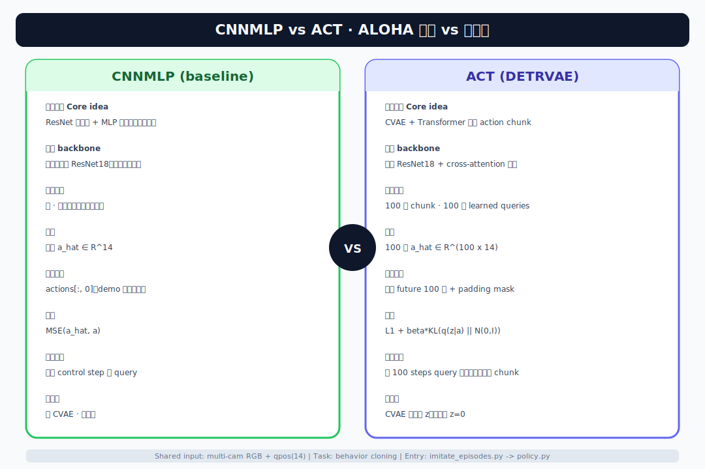
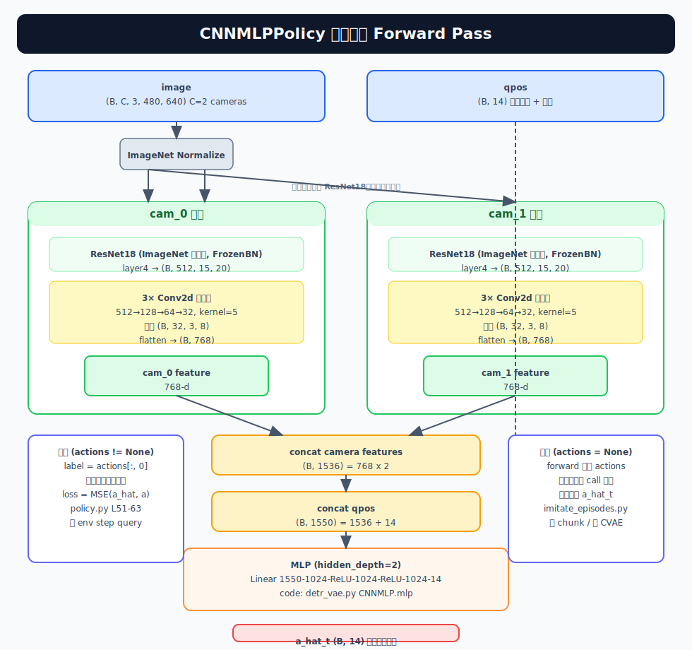
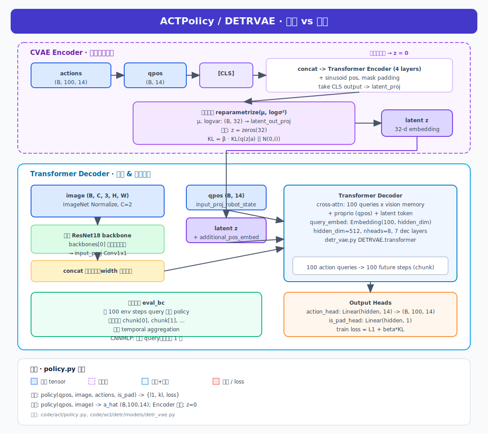

# CNNMLPPolicy 代码导读

> **定位**：ALOHA 论文里的 **消融 baseline** —— 不用 Action Chunk、不用 CVAE、不用 Transformer，只用 **ResNet + MLP** 做逐步模仿学习。  
> **读法**：自顶向下 6 层，每层先讲「干什么」，再讲「代码在哪、tensor 形状」。  
> **姊妹篇**：[ACTPolicy 代码导读](./ACTPolicy-Code-Walkthrough.md)（chunk + CVAE + Transformer）

---

## 0. 30 秒总结

```text
观测（当前一帧图像 + qpos）
    → 每路相机独立 ResNet18 提特征
    → 3 层 Conv 压到 768 维/相机
    → concat 所有相机 + qpos(14)
    → 2 层 MLP
    → 输出 14 维关节目标（单步）

训练：监督 = demo 的「下一步」action，损失 = MSE
推理：每控制周期 call 一次 policy，直接执行输出
```

### 0.1 模型结构图







<details>
<summary>ASCII 备用（终端 / 无图环境）</summary>

```
┌──────────────────────────────────────────────────────────────┐
│                       CNNMLPPolicy                            │
│                                                               │
│  输入                                                         │
│  ┌─────────────────────────────────────────────────────┐     │
│  │  image: (B, C, 3, 480, 640)    qpos: (B, 14)        │     │
│  │   C = 相机数（默认 2）                                │     │
│  └────────────┬───────────────────────┬────────────────┘     │
│               │                       │                       │
│     ┌─────────▼─────────┐   ┌────────▼─────────┐             │
│     │  cam_0 支路        │   │  cam_1 支路       │  ...       │
│     │                    │   │                   │             │
│     │  ImageNet Norm     │   │  ImageNet Norm    │             │
│     │       │            │   │       │           │             │
│     │       ▼            │   │       ▼           │             │
│     │  ResNet18          │   │  ResNet18         │  ← 独立权重 │
│     │  (预训练, frozenBN) │   │  (预训练, frozenBN)│            │
│     │  layer4 输出       │   │  layer4 输出      │             │
│     │  (B,512,15,20)     │   │  (B,512,15,20)    │             │
│     │       │            │   │       │           │             │
│     │       ▼            │   │       ▼           │             │
│     │  Conv2d 512→128    │   │  Conv2d 512→128   │  k=5       │
│     │  Conv2d 128→64     │   │  Conv2d 128→64    │  k=5       │
│     │  Conv2d 64→32      │   │  Conv2d 64→32     │  k=5       │
│     │  (B,32,3,8)        │   │  (B,32,3,8)       │             │
│     │       │            │   │       │           │             │
│     │       ▼            │   │       ▼           │             │
│     │  flatten           │   │  flatten          │             │
│     │  (B, 768)          │   │  (B, 768)         │             │
│     └────────┬───────────┘   └────────┬──────────┘             │
│              │                        │                        │
│              └──────────┬─────────────┘                        │
│                         ▼                                      │
│                  concat: (B, 1536)                              │
│                         │                                      │
│              qpos ──────┤                                      │
│              (B, 14)    ▼                                      │
│                  concat: (B, 1550)                              │
│                         │                                      │
│              ┌──────────▼──────────┐                           │
│              │  MLP (2 hidden)      │                           │
│              │                      │                           │
│              │  Linear 1550 → 1024  │                           │
│              │       ReLU           │                           │
│              │  Linear 1024 → 1024  │                           │
│              │       ReLU           │                           │
│              │  Linear 1024 → 14    │                           │
│              └──────────┬──────────┘                           │
│                         │                                      │
│                         ▼                                      │
│              输出: â_t (B, 14)                                  │
│              [left_arm×6, left_grip, right_arm×6, right_grip]  │
└──────────────────────────────────────────────────────────────┘

对比 ACT Decoder:

        CNNMLP                          ACT Decoder
        ────────                        ───────────
  输入   当前帧图像 + qpos              当前帧图像 + qpos + z(32)
  视觉   每相机独立 ResNet              共享 ResNet
  压缩   3 层 Conv flatten               无 down_proj，送 Transformer
  融合   concat + MLP                   Transformer cross-attention
  输出   单步 14 维                      100 步 × 14 维
  损失   MSE(â, a)                      L1(â, a) + β·KL
```

**与 ACT 的本质差别**：CNNMLP **一次只预测 1 步**；ACT 一次预测 100 步 chunk + CVAE。

</details>

---

## 1. 第 0 层：谁调用 CNNMLPPolicy？

**文件**：[`code/act/imitate_episodes.py`](../../../code/act/imitate_episodes.py)

### 1.1 创建 Policy

```python
# L69-71：配置
elif policy_class == 'CNNMLP':
    policy_config = {
        'lr': args['lr'],
        'lr_backbone': lr_backbone,   # 1e-5
        'backbone': 'resnet18',
        'num_queries': 1,             # 占位，CNNMLP 不用 chunk
        'camera_names': camera_names,
    }

# L121-127
def make_policy(policy_class, policy_config):
    elif policy_class == 'CNNMLP':
        policy = CNNMLPPolicy(policy_config)
```

### 1.2 训练循环

```text
train_bc()
  → policy = CNNMLPPolicy(...)
  → for batch in train_dataloader:
        forward_dict = forward_pass(data, policy)
        forward_dict['loss'].backward()
```

```python
# L316-319
def forward_pass(data, policy):
    image_data, qpos_data, action_data, is_pad = data
    return policy(qpos_data, image_data, action_data, is_pad)
    #                                      ↑ 有 actions → 训练模式
```

### 1.3 评估循环

```python
# L262-263：每个 env step 都 query，无 chunk
elif config['policy_class'] == "CNNMLP":
    raw_action = policy(qpos, curr_image)   # 无 actions → 推理模式
```

对比 ACT：ACT 每 100 步才 query 一次；CNNMLP **每步都 query**。

---

## 2. 第 1 层：`CNNMLPPolicy` — 训练/推理分叉

**文件**：[`code/act/policy.py`](../../../code/act/policy.py) L44-69

### 2.1 类结构

```python
class CNNMLPPolicy(nn.Module):
    def __init__(self, args_override):
        model, optimizer = build_CNNMLP_model_and_optimizer(args_override)
        self.model = model      # 实际是 CNNMLP 类
        self.optimizer = optimizer
```

对外 **唯一入口**：`__call__(qpos, image, actions=None, is_pad=None)`

### 2.2 训练分支（`actions is not None`）

```python
# L51-63
normalize = transforms.Normalize(mean=[0.485, 0.456, 0.406],
                                 std=[0.229, 0.224, 0.225])
image = normalize(image)

actions = actions[:, 0]                    # ★ 只取未来第 1 步
a_hat = self.model(qpos, image, env_state, actions)
mse = F.mse_loss(actions, a_hat)
return {'mse': mse, 'loss': mse}
```

要点：

| 项 | 说明 |
|----|------|
| `actions[:, 0]` | DataLoader 给的是 `(B, episode_len, 14)` pad 后的序列；CNNMLP **只用 index=0**（相对 start_ts 的下一步） |
| `is_pad` | **传入但不用** — pad 步的 action 若为 0 仍会进 MSE（小瑕疵，数据里 episode 末段才有 pad） |
| `actions` 传入 model | model.forward 里 **完全不读 actions**（见第 4 层） |
| 损失 | 纯 **MSE**，无 KL、无 L1 |

### 2.3 推理分支（`actions is None`）

```python
# L64-66
a_hat = self.model(qpos, image, env_state)
return a_hat    # shape (B, 14)
```

- 不做 loss
- 网络 forward **与训练路径相同**（CNNMLP 内部无 train/eval 分支）

### 2.4 训练 vs 推理（Policy 层）

| | 训练 | 推理 |
|---|------|------|
| 调用 | `policy(qpos, img, actions, is_pad)` | `policy(qpos, img)` |
| `actions[:, 0]` | 作 **标签** | 无 |
| model 输入 | qpos + image | 相同 |
| 输出 | `(B, 14)` | `(B, 14)` |
| 返回 | `{'loss', 'mse'}` | `a_hat` |

---

## 3. 第 2 层：模型构建与优化器

**文件**：[`code/act/detr/main.py`](../../../code/act/detr/main.py) L93-113

```python
def build_CNNMLP_model_and_optimizer(args_override):
    model = build_CNNMLP_model(args)    # → detr/models/__init__.py
    model.cuda()

    param_dicts = [
        {"params": [非 backbone 参数], "lr": args.lr},           # 1e-4
        {"params": [backbone 参数],     "lr": args.lr_backbone}, # 1e-5
    ]
    optimizer = torch.optim.AdamW(param_dicts, ...)
    return model, optimizer
```

**文件**：[`code/act/detr/models/__init__.py`](../../../code/act/detr/models/__init__.py)

```python
def build_CNNMLP_model(args):
    return build_cnnmlp(args)   # detr_vae.py
```

**文件**：[`code/act/detr/models/detr_vae.py`](../../../code/act/detr/models/detr_vae.py) L257-277

```python
def build_cnnmlp(args):
    backbones = []
    for _ in args.camera_names:          # ★ 每个相机一个独立 ResNet18
        backbone = build_backbone(args)
        backbones.append(backbone)

    model = CNNMLP(backbones, state_dim=14, camera_names=args.camera_names)
    return model
```

与 ACT 对比：ACT **所有相机共用一个** `backbones[0]`；CNNMLP **每相机一套 ResNet**（参数量更大）。

---

## 4. 第 3 层：`CNNMLP` 网络结构

**文件**：[`code/act/detr/models/detr_vae.py`](../../../code/act/detr/models/detr_vae.py) L143-209

### 4.1 模块清单

```text
CNNMLP
├── backbones[i]              # 每相机：Joiner(ResNet18, position_encoding)
│     └── 实际 CNNMLP 只用 features，pos 丢弃
├── backbone_down_projs[i]    # 每相机：3×Conv2d 512→128→64→32
└── mlp                       # Linear(1550→1024→1024→14)  [2 相机时]
```

`mlp_in_dim = 768 * len(camera_names) + 14`

典型 ALOHA 仿真 2 相机：`768×2 + 14 = 1550`

### 4.2 768 维怎么来的？

ResNet18 最后一层 feature map：**512 通道**，空间尺寸取决于输入分辨率（约 H/32 × W/32）。

经 3 层 **kernel=5、无 padding** 的 Conv，spatial 每层 -4：

```text
假设 layer4 输出 spatial ≈ 15×20（480×640 输入时）
  Conv 512→128, k5  →  11×16
  Conv 128→64,  k5  →   7×12
  Conv 64→32,   k5  →   3×8

flatten: 32 × 3 × 8 = 768 维/相机
```

代码注释 `# 768 each` 即由此而来；**换图像分辨率会改变 MLP 输入维度**（硬编码 flatten，需与训练分辨率一致）。

### 4.3 `forward` 完整数据流

```python
def forward(self, qpos, image, env_state, actions=None):
    is_training = actions is not None   # ★ 仅赋值，后续未使用

    bs, _ = qpos.shape                  # qpos: (B, 14)
    all_cam_features = []

    for cam_id, cam_name in enumerate(self.camera_names):
        features, pos = self.backbones[cam_id](image[:, cam_id])
        features = features[0]          # layer4 输出 (B, 512, H', W')
        pos = pos[0]                    # 未使用

        down = self.backbone_down_projs[cam_id](features)  # (B, 32, h, w)
        all_cam_features.append(down)

    flattened = []
    for cam_feature in all_cam_features:
        flattened.append(cam_feature.reshape([bs, -1]))     # (B, 768)
    flattened = torch.cat(flattened, axis=1)              # (B, 768*num_cam)

    features = torch.cat([flattened, qpos], axis=1)       # (B, 768*num_cam+14)
    a_hat = self.mlp(features)                            # (B, 14)
    return a_hat
```

### 4.4 Tensor 形状一览（B=batch, C=相机数，默认 C=2）

| 步骤 | Tensor | Shape |
|------|--------|-------|
| 输入 image | 多相机 RGB | `(B, C, 3, H, W)` |
| 输入 qpos | 关节角 | `(B, 14)` |
| ResNet layer4 / 相机 | feature map | `(B, 512, H', W')` |
| down_proj 后 / 相机 | | `(B, 32, h, w)` |
| flatten / 相机 | | `(B, 768)` |
| concat 相机 | | `(B, 768×C)` |
| + qpos | MLP 输入 | `(B, 768×C + 14)` |
| 输出 a_hat | 预测关节目标 | `(B, 14)` |

### 4.5 MLP 结构（`mlp()`  helper）

```python
# hidden_depth=2 → 2 个 hidden 层
Linear(in_dim, 1024) → ReLU
Linear(1024, 1024)   → ReLU
Linear(1024, 14)
```

无 dropout、无 LayerNorm、无 action chunking。

---

## 5. 第 4 层：视觉骨干 ResNet18

**文件**：[`code/act/detr/models/backbone.py`](../../../code/act/detr/models/backbone.py)

```python
def build_backbone(args):
    backbone = Backbone('resnet18', train_backbone=(lr_backbone>0), ...)
    model = Joiner(backbone, position_embedding)
    return model
```

- **ResNet18** ImageNet 预训练权重
- **FrozenBatchNorm2d**：BN 统计量固定（DETR 惯例）
- `return_layers = {'layer4': "0"}`：只取 **最后一层** 特征
- `num_channels = 512`

CNNMLP 调用方式：

```python
features, pos = self.backbones[cam_id](image[:, cam_id])
features = features[0]   # 512 通道 feature map
```

**Policy 层**在进 backbone 前做 **ImageNet Normalize**（mean/std）；**Dataset 层**只做 `/255.0`。

---

## 6. 第 5 层：数据从 HDF5 到 batch

**文件**：[`code/act/utils.py`](../../../code/act/utils.py)

### 6.1 单条样本

```python
start_ts = random choice                    # 随机「当前时刻」
qpos     = observations/qpos[start_ts]      # 当前关节，(14,)
image    = images[cam][start_ts]            # 当前帧，每相机一张
action   = action[start_ts:]                # 从当前起的未来动作序列
```

Pad 到 `episode_len`，`is_pad` 标记假步。

归一化：

```python
qpos  = (qpos - qpos_mean) / qpos_std
action = (action - action_mean) / action_std
image  = image / 255.0
```

### 6.2 CNNMLP 实际用哪些字段

| 字段 | CNNMLP 训练 | CNNMLP 推理 |
|------|------------|------------|
| `image` | ✅ 当前帧 | ✅ |
| `qpos` | ✅ | ✅ |
| `action[:, 0]` | ✅ 标签 | — |
| `action[:, 1:]` | ❌ 丢弃 | — |
| `is_pad` | ❌ 未用于 loss mask | — |

**含义**：CNNMLP 学的是 **马尔可夫一步 BC** ——  
「看到当前 (image, qpos)，预测下一步 joint target」，不显式规划未来轨迹。

---

## 7. 第 6 层：评估时动作如何进环境

**文件**：`imitate_episodes.py` — `eval_bc`

```python
# 预处理
qpos = (qpos_numpy - qpos_mean) / qpos_std
curr_image = get_image(ts, camera_names)    # (1, C, 3, H, W), 已 /255

# 推理
raw_action = policy(qpos, curr_image)       # (1, 14)

# 后处理
action = raw_action * action_std + action_mean
env.step(action)                            # 14 维 absolute joint position
```

14 维语义（ALOHA）：

```text
[left_arm_joint×6, left_gripper, right_arm_joint×6, right_gripper]
```

**无** chunk 缓存、**无** temporal aggregation、**无** query_frequency。

---

## 8. 端到端流程图

### 训练

```text
episode_{i}.hdf5
    │
    ▼ EpisodicDataset.__getitem__
(image, qpos, action_pad, is_pad)
    │
    ▼ DataLoader  batch
    │
    ▼ forward_pass → CNNMLPPolicy(qpos, image, actions, is_pad)
    │                    │
    │                    ├─ ImageNet norm(image)
    │                    ├─ label = actions[:, 0]
    │                    └─ CNNMLP(qpos, image) → a_hat (B,14)
    │                              │
    │                              ├─ cam0: ResNet18 → down_proj → 768
    │                              ├─ cam1: ResNet18 → down_proj → 768
    │                              ├─ concat [1536, qpos14] → MLP → 14
    │                              │
    ▼                    loss = MSE(a_hat, label)
    backward + AdamW
```

### 推理

```text
env.obs → qpos, images
    → normalize
    → CNNMLPPolicy(qpos, image)     # 无 actions
    → CNNMLP → (1, 14)
    → denormalize
    → env.step
    （下一控制周期重复）
```

---

## 9. CNNMLPPolicy 的缺点与局限

> CNNMLP **不是设计失误**，而是 ALOHA 论文里刻意保留的 **对照组**：用最朴素的 BC 证明「chunk + CVAE + Transformer」每一项都有独立贡献。  
> 读它的代码，重点不是学怎么部署，而是理解 **ACT 究竟在解决什么问题**。

### 9.1 一句话

CNNMLP = **只看当前帧、只预测下一步、用 MSE 硬回归** 的马尔可夫 BC。  
在需要 **长 horizon 协调、人类 demo 多模态、毫米级精度** 的双臂任务上，这套假设会同时失效。

### 9.2 算法层缺点（最根本）

| 缺点 | 人话 | 代码 / 论文依据 |
|------|------|----------------|
| **误差累积（compounding error）** | 第 1 步偏 1°，第 10 步可能就抓空；每步都重新决策，**没有「先想好一段再执行」** | 推理每 env step 都 `policy(qpos, image)`（`imitate_episodes.py` L262-263）；论文消融 **k=1（等价逐步 BC）成功率仅 1%**，k=100 约 **44%** |
| **短视（myopic）** | 训练标签只有 `actions[:, 0]`，模型从未被监督「未来 100 步该怎么配合」 | `policy.py` L52：`actions = actions[:, 0]`；`CNNMLP.forward` 里 `actions` **不参与**前向 |
| **多模态 demo 学平均** | 同一场景左绕、右绕都合理时，MSE 会学成 **两条轨迹的均值** → 可能撞障碍或卡住 | 损失 `F.mse_loss`（`policy.py` L59）；论文：人类 demo 有 pause、路径随机 → 需 CVAE（无 CVAE 时 human demo 成功率 **2% vs 35%**） |
| **无隐变量 / 无 CVAE** | 确定性映射 `f(obs)→a`，无法表达「这次演示选左绕还是右绕」 | 对比 ACT 的 `mu, logvar → z`；CNNMLP 推理路径无任何 latent |
| **无 Temporal Ensembling** | 相邻两步独立预测，动作更容易 **抖动**；ACT 可对重叠 chunk 加权平均 | `eval_bc` 里 CNNMLP 分支 **没有** `temporal_agg` 逻辑（L247-263 仅 ACT 有） |

**误差累积直觉**（ALOHA 精细任务）：

```text
t=0   预测 â₀ → 执行 → 真机状态偏离 demo 一点点
t=1   用「已偏离」的 obs 再预测 â₁ → 偏差放大
...
t=50  穿线 / 插电池等任务：累计偏差 → 完全失败
```

ACT 用 chunk 把有效 horizon 缩短约 **k 倍**（默认 k=100），并在 chunk 内按开环执行，减少「每步都重新犯错」的机会。

### 9.3 结构层缺点（代码里能看见）

| 缺点 | 说明 | 代码位置 |
|------|------|----------|
| **无 attention，全靠 flatten + MLP** | 把 `(B,32,3,8)` conv 特征 **全展平** 再进 MLP，无法像 Transformer 那样 **对关键像素/区域做 cross-attn** | `detr_vae.py` L192-196：`reshape` → `cat` → `mlp` |
| **相机间 late fusion** | 每路相机 **独立 ResNet18 + 独立 down_proj**，只在最后 concat；早期无法做跨视角几何推理 | `build_cnnmlp` 为每个 camera 各 `build_backbone`（L264-266）；forward 用 `backbones[cam_id]`（L186） |
| **参数量偏大但表达力不匹配** | 2 相机 ≈ **2 套 ResNet18**，却比 ACT **少** chunk/CVAE/Transformer 能力；性价比低 | 对比 ACT 共享 `backbones[0]` + 一个 Decoder |
| **MSE 对 outliers 敏感** | 相比 ACT 的 L1，MSE 对大误差惩罚更重，训练可能被 **少数坏帧** 拉偏 | ACT：`F.l1_loss`（`policy.py` L47-48） |
| **无 padding / 变长序列处理** | 训练虽传入 `is_pad`，CNNMLP **完全忽略**；只取单步标签 | `CNNMLPPolicy.__call__` 签名有 `is_pad` 但未使用 |

### 9.4 推理与部署缺点

| 缺点 | 影响 |
|------|------|
| **每步都跑完整 ResNet×2 + MLP** | 50Hz 控制下计算 **比 ACT 更频繁**（ACT 每 100 步才 query 一次）；latency 和 GPU 负载更高 |
| **无 chunk 缓存** | 无法「算一次用 100 步」；开环段内的动作一致性差 |
| **无 reactive 与 open-loop 的平衡旋钮** | ACT 可调 `chunk_size`（论文：k 过大 reactive 变差，过小 compounding 严重）；CNNMLP 固定 **k=1** |
| **仿真 / 真机泛化无额外结构** | 与 ACT 一样依赖 BC，但没有 chunk 平滑，sim2real 误差往往 **更明显** |

### 9.5 论文实验里有多差？（相对 ACT）

ALOHA 主文 Table I / 消融（详见 [ALOHA 论文笔记 §6](./ALOHA-Learning-Fine-Grained-Bimanual-Manipulation.md)）：

| 现象 | 数据 / 描述 |
|------|-------------|
| Chunk size k=1 | ACT 框架下成功率 **~1%**（几乎等于「不用 chunking 的 BC」） |
| 同任务 ACT vs baseline | 开杯、穿 Velcro、贴胶带等：**ACT 80–90% 量级，BC-ConvMLP 等 baseline 常 <30%** |
| 长 horizon 任务 | baseline 常见 **episode 末尾崩溃、无限 pause** |
| 人类 demo | 无 CVAE 的逐步 BC 几乎学不会；CNNMLP 也 **无 CVAE** |

→ CNNMLP 在论文里的角色是：**「如果不用 ACT 的三件套，精细双臂会差到一个数量级」** 的证据。

### 9.6 什么时候 CNNMLP 仍然有用？

不是一无是处，适合这些场景：

| 场景 | 原因 |
|------|------|
| **读代码入门** | 结构最短：ResNet → MLP → MSE，先搞懂 `policy.py` 训练/推理分叉 |
| **极简 baseline / 消融** | 改一个模块（backbone、相机数）做 A/B，CNNMLP 变量少 |
| **单步、近似马尔可夫的任务** | 如「抓大物体、短位移」—— compounding 不明显 |
| **算力极受限且任务简单** | 无 Transformer；但若任务难，省下的结构能力会还回去 |

**不适合**：穿线、插电池、双臂协同时序长、人类 demo 多路径的 ALOHA 级任务 —— 这正是 ACT 存在的理由。

### 9.7 与 ACT 对照（为何论文要换掉它）

| 局限 | CNNMLP | ACT 的应对 |
|------|--------|------------|
| 逐步预测 → 误差累积 | 每步 query，输出 1 步 | **100 步 chunk**，有效 horizon ÷100 |
| 多模态 demo | MSE 学平均 | **CVAE** 隐变量 z |
| 视觉融合弱 | flatten + MLP | **Transformer cross-attention** |
| 动作抖动 | 无 | **Temporal Ensembling**（可选） |
| 训练目标 | 只监督下一步 | 监督 **整段 future** + L1 + KL |

ALOHA 论文用 CNNMLP 作 baseline，精细任务上 ACT **显著更好** —— 缺点清单即 ACT 的设计动机清单。

---

## 10. 关键文件速查

| 顺序 | 文件 | 读什么 |
|:----:|------|--------|
| 1 | `imitate_episodes.py` | L69-71 配置；L262-263 评估；L316-319 训练 |
| 2 | `policy.py` | `CNNMLPPolicy` 全文（69 行类） |
| 3 | `detr/main.py` | `build_CNNMLP_model_and_optimizer` |
| 4 | `detr_vae.py` | `CNNMLP` + `build_cnnmlp` |
| 5 | `backbone.py` | ResNet18 怎么 build |
| 6 | `utils.py` | `EpisodicDataset` 字段含义 |

---

## 11. 自测

- [ ] CNNMLP 训练标签是 action 的第几步？（**第 0 步**，即 `actions[:,0]`）
- [ ] `CNNMLP.forward` 里 `actions` 参数有没有参与计算？（**没有**）
- [ ] 推理时每几个 env step 调用一次 policy？（**每步 1 次**）
- [ ] 每路相机有几套 ResNet？（**各 1 套**，独立权重）
- [ ] MLP 输入维度（2 相机）？（**1550** = 768×2+14）
- [ ] 损失函数？（**MSE**，无 KL）
- [ ] CNNMLP 最主要的 3 个缺点？（**误差累积、多模态学平均、无 attention/chunk**）
- [ ] 论文里 k=1 时 ACT 成功率大约多少？（**~1%**）

---

*下一篇：[ACTPolicy 代码导读](./ACTPolicy-Code-Walkthrough.md)*
