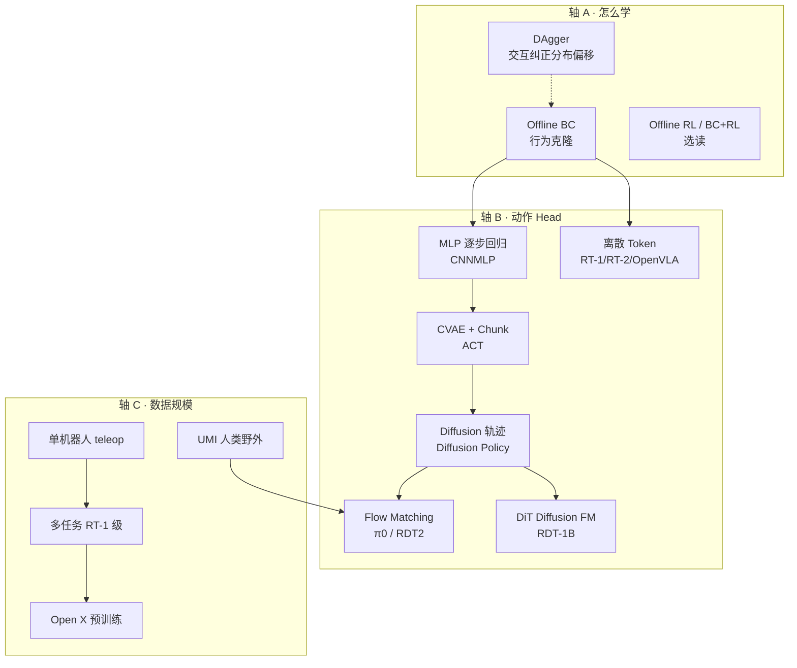

# 模仿学习主要范式 · 全局概览与论文阅读顺序

> **本文目标**：用 **三条正交轴** 串起机器人模仿学习（IL）的全部主流范式，给出 **完整论文阅读顺序**，并链接到各范式精读笔记。  
> **预计通读**：2–3 小时（概览）；按顺序精读 **6–8 周**（每天 1–2 小时）。

---

## 一、先建立坐标系：三条轴

模仿学习论文常混谈三个维度。读任何一篇前先问：**它在改「怎么学」、「怎么输出动作」、还是「数据从哪来/多大规模」？**

```text
轴 A · 怎么学（Learning Paradigm）
  Offline BC ── Interactive IL (DAgger) ── IRL/GAIL ── Offline RL ── BC + RL 微调

轴 B · 动作怎么建模（Action Head）          ← ACT / DP / RDT / RT-2 主要在这里
  MLP 回归 ── CVAE(ACT) ── 离散 Token ── Diffusion ── Flow Matching ── 混合(RVQ+FM)

轴 C · 数据与规模（Data & Scale）
  单任务 teleop ── 多任务单机器人 ── Open X 跨 embodiment ── UMI 人类野外 ── Web+VLM co-train
```

**ACT、Diffusion Policy、RDT 不能代表全部机器人学习**——它们覆盖了 **IL 中 Offline BC + 连续/离散 Action Head** 的主线。完整训练地图（含 **RL、Co-train、RLHF**）见 [**VLA 训练范式全景图**](../../VLA训练范式全景图.md)。

---

## 二、范式全景图（按历史演进）



---

## 三、主要范式速查表

| # | 范式 | 代表论文 | 轴 A | 轴 B | 监督信号 | 本地笔记 |
|:-:|------|---------|:----:|:----:|---------|---------|
| 0 | **BC 基础 / 误差累积** | What Matters in IL | BC | MLP | MSE(action) | [BC与行为克隆基础](./BC与行为克隆基础.md) |
| 1 | **交互式 IL** | DAgger | DAgger | 任意 π | 专家在新状态上的 action | [DAgger](../DAgger-Dataset-Aggregation.md) |
| 2 | **BC + Chunk + CVAE** | ALOHA / ACT | BC | CVAE+Chunk | L1 + KL | [ALOHA 笔记集](../ALOHA/概述.md) |
| 3 | **Diffusion 动作轨迹** | Diffusion Policy | BC | DDPM | 去噪 MSE | [Diffusion Policy](../Diffusion-Policy/概述.md) |
| 4 | **野外人类 demo + DP** | UMI | BC | DP | 去噪 MSE（relative EEF） | [UMI](../UMI-Universal-Manipulation-Interface.md) |
| 5 | **多任务 Robot Transformer** | RT-1 | BC | 离散 token | CE(next token) | [RT-1](./RT-1-Robotics-Transformer.md) |
| 6 | **VLA 开山** | RT-2 | BC + co-train | 离散 token | CE（VLM 词表） | [RT-2](./RT-2-Vision-Language-Action.md) |
| 7 | **开源离散 VLA** | OpenVLA | BC | 离散 token | CE + LoRA | [OpenVLA](./OpenVLA.md) |
| 8 | **通用 Transformer Policy** | Octo | BC | 离散/Diffusion | 多任务 BC | [Octo](./Octo.md) |
| 9 | **Flow Matching VLA** | π0 | BC | Flow | velocity field MSE | [π0](./Pi0-Flow-Matching-VLA.md) |
| 10 | **Diffusion FM + 统一动作** | RDT-1B | BC pretrain+ft | DiT Diffusion | 去噪 MSE（128-d） | [RDT](../RDT-Foundation-Models.md) |
| 11 | **UMI scale + 混合 VLA** | RDT2 | BC | RVQ+FM | CE + Flow + 蒸馏 | [RDT §Part B](../RDT-Foundation-Models.md#part-b-rdt2) |
| 12 | **数据基础设施** | Open X-Embodiment | — | — | RLDS 格式 | [VLA 数据综述](../VLA-Datasets-Benchmarks-Data-Engines.md) |

---

## 四、完整论文阅读顺序（推荐 8 阶段）

> 符号：⭐ 主线必读 · ○ 选读 · ✅ 本地 PDF 已收录 · 🔤 有中文译

### Phase 0 · 建立 IL 直觉（3–5 天）

**要搞懂**：BC 是什么、误差累积为何发生、Chunk/Diffusion 为何被提出。

| 序 | 优先级 | 论文 | arXiv | 笔记 | 读什么 |
|:--:|:------:|------|-------|------|--------|
| 0.1 | ⭐ | **ALOHA**（含 CNNMLP + ACT） | 2304.13705 | [ALOHA](../ALOHA/概述.md) | Intro + Method；对照 CNNMLP vs ACT |
| 0.2 | ○ | **What Matters in IL** | 2106.00672 | [BC 基础](./BC与行为克隆基础.md) | Abstract + 结论：数据量/质量规律 |
| 0.3 | ○ | **DAgger** | 1011.0686 | [DAgger](../DAgger-Dataset-Aggregation.md) | §1–2：分布偏移与 $T^2\epsilon$ |

**Phase 0 自测**：
- BC 和 VLA 的训练目标有何相同？（都是 demo 监督）
- 为什么 ACT 要 Chunk？为什么还需要 CVAE？
- DAgger 解决的是轴 A 还是轴 B 的问题？（轴 A）

---

### Phase 1 · 连续动作 Policy Head（1 周）

**要搞懂**：多模态 demo、horizon、receding horizon、relative delta action。

| 序 | 优先级 | 论文 | arXiv | 笔记 | 读什么 |
|:--:|:------:|------|-------|------|--------|
| 1.1 | ⭐ | **Diffusion Policy** | 2303.04137 | [DP 概述](../Diffusion-Policy/概述.md) | §1–3 + Method 全文 |
| 1.2 | ⭐ | **ACT**（ALOHA 论文 ACT 节） | 2304.13705 | [ACT 原理](../ALOHA/ACT-Model-Working-Principles.md) | k=100、CVAE、temporal agg |
| 1.3 | ⭐ | **UMI** | 2402.10329 | [UMI](../UMI-Universal-Manipulation-Interface.md) | 硬件/策略双接口；为何 DP+relative delta |
| 1.4 | ○ | **3D Diffusion Policy** | 2406.01586 | — | 点云 obs 的 diffusion 扩展 |

**Phase 1 对照**：

| | ACT | Diffusion Policy | UMI+DP |
|---|-----|------------------|--------|
| 多模态 | CVAE latent z | 扩散采样 | 扩散采样 |
| 输出 | joint chunk 14D | EEF/sim action horizon | relative EEF delta |
| 速度 | 快（一次前向） | 慢（多步 denoise） | 同 DP |
| 典型数据 | 双臂 teleop | sim + 少量 real | 人类野外 |

---

### Phase 2 · 多任务 Transformer（1 周）

**要搞懂**：如何把 700+ 任务合成一个模型；action discretization 的起源。

| 序 | 优先级 | 论文 | arXiv | 笔记 | 读什么 |
|:--:|:------:|------|-------|------|--------|
| 2.1 | ⭐ | **RT-1** | 2212.06817 | [RT-1](./RT-1-Robotics-Transformer.md) | §1–4 + Fig 2：TokenLearner、离散 action |
| 2.2 | ○ | **BC-Z** | 2203.02827 | — | 语言条件 BC 早期大规模尝试 |
| 2.3 | ○ | **BridgeData V2** | 2309.12247 | — | 开放环境 teleop 数据集 |

---

### Phase 3 · VLA 开山 + 数据基础设施（1–2 周）

**要搞懂**：VLA 定义、action token、web co-train、Open X 为何重要。

| 序 | 优先级 | 论文 | arXiv | 笔记 | 读什么 |
|:--:|:------:|------|-------|------|--------|
| 3.1 | ⭐ | **Open X-Embodiment** | 2310.08864 | [VLA 数据](../VLA-Datasets-Benchmarks-Data-Engines.md) | §3–4：RLDS、RT-1-X |
| 3.2 | ⭐ | **RT-2** | 2307.15818 | [RT-2](./RT-2-Vision-Language-Action.md) | 全文：VLA 定义、co-train |
| 3.3 | ○ | **PaLM-E** | 2303.03378 | — | 多模态 embodied 输入嵌入 LLM |
| 3.4 | ○ | **VIMA** | 2210.03094 | — | 结构化 language + token 操作 |

**Phase 3 自测**：
- RT-2 的 7 维连续动作如何变成 token？
- 为什么 RT-1 数据不够，需要 Open X？

---

### Phase 4 · 开源 VLA 生态（1–2 周）

**要搞懂**：7B VLA 如何复现；LoRA finetune；OXE dataloader。

| 序 | 优先级 | 论文 | arXiv | 笔记 | 读什么 |
|:--:|:------:|------|-------|------|--------|
| 4.1 | ⭐ | **OpenVLA** | 2406.09246 | [OpenVLA](./OpenVLA.md) | §3–5：Prismatic VLM、离散 action |
| 4.2 | ⭐ | **Octo** | 2405.12250 | [Octo](./Octo.md) | §2–4：通用 policy、finetune 协议 |
| 4.3 | ○ | **RoboCat** | 2306.11706 | — | 自改进 data flywheel |

---

### Phase 5 · 连续 VLA / Flow / Diffusion FM（1–2 周）

**要搞懂**：工业界为何转向 Flow；Unified Action Space；预训练 vs 微调。

| 序 | 优先级 | 论文 | arXiv | 笔记 | 读什么 |
|:--:|:------:|------|-------|------|--------|
| 5.1 | ○ | **Flow Matching 教程** | 2404.08427 | [π0 §FM](./Pi0-Flow-Matching-VLA.md#flow-matching-是什么) | §1–2：π0 理论基础 |
| 5.2 | ⭐ | **π0** | 2410.24164 | [π0](./Pi0-Flow-Matching-VLA.md) | Flow matching + PaliGemma |
| 5.3 | ⭐ | **RDT-1B** | 2024 | [RDT](../RDT-Foundation-Models.md) | DiT、128-d Unified Action |
| 5.4 | ⭐ | **RDT2** | 2602.03310 | [RDT Part B](../RDT-Foundation-Models.md#part-b-rdt2) | UMI 10k 小时 + RVQ→FM |

**Phase 5 三代对照**：

| | OpenVLA | π0 | RDT-1B | RDT2 |
|---|---------|-----|--------|------|
| Action Head | 离散 CE | Flow | Diffusion | RVQ + Flow |
| 预训练数据 | OXE ~970K | 私有 10K+ hr | OXE 1M+ | UMI 10K+ hr |
| 语言 | Llama | PaliGemma | T5-XXL | Qwen2.5-VL |
| 精细操作 | 一般 | 强 | 强（双臂） | 强 + 零样本跨 embodiment |

---

### Phase 6 · 综述串联（1 周）

| 序 | 优先级 | 论文 | 笔记 |
|:--:|:------:|------|------|
| 6.1 | ⭐ | VLA Datasets, Benchmarks, Data Engines | [数据综述](../VLA-Datasets-Benchmarks-Data-Engines.md) |
| 6.2 | ⭐ | VLA Anatomy Survey | [算法层清单 §Layer 6](../../VLA算法层学习路线与论文清单.md#layer-6--综述建立算法数据统一视图1-周) |
| 6.3 | ○ | VLA Systematic Review | 同上 |

---

### Phase 7 · 前沿（选读）

| 主题 | 代表 | 说明 |
|------|------|------|
| Ego 视频 → VLA | EgoVLA, EgoScale | 人类视频预训练 |
| 世界模型 | UniSim, 3D-VLA | 视频预测式训练 |
| RL post-train | RLAIF-V, RoboRL | 部署后优化 |
| Offline RL | CQL, IQL | 超越纯 BC 的数据利用 |

---

## 五、按周计划（8 周版）

| 周 | Phase | 核心产出 |
|:--:|-------|---------|
| 1 | 0 + 1 前半 | 能解释 BC / compounding error；读完 DP 动机 |
| 2 | 1 后半 | 对照 ACT vs DP vs UMI；跑通或读透 DP 代码 |
| 3 | 2 + 3 前半 | 理解 RT-1 离散 action；Open X 数据格式 |
| 4 | 3 后半 | RT-2 VLA 定义；画出 RT-1→RT-2 演进 |
| 5 | 4 | OpenVLA / Octo 训练配置；LoRA finetune 流程 |
| 6 | 5 | 对比 π0 vs RDT vs OpenVLA 三种 Recipe |
| 7 | 5 + 6 | RDT2 混合训练；综述写出「数据×算法」双轴地图 |
| 8 | 7 + 实践 | LeRobot finetune 一个 checkpoint |

---

## 六、Action Head 三代演进（轴 B 主线）

```text
Gen-0  逐步回归        CNNMLP / 早期 BC
         │  问题：多模态平均、horizon 误差
         ▼
Gen-1  Chunk + CVAE    ACT (ALOHA)
         │  问题：VAE 表现力有限；仍难覆盖复杂多模态
         ▼
Gen-2  扩散轨迹        Diffusion Policy → 3D-DP
         │  问题：推理慢；未与 VLM 统一
         ├──────────────────────┐
         ▼                      ▼
Gen-3a 离散 Token VLA   RT-1 → RT-2 → OpenVLA / Octo
Gen-3b 连续 Flow/Diff FM  π0 / RDT-1B / RDT2
```

**读论文时的关键问题**：
- 连续还是离散？（精度 vs 与 VLM 统一）
- 单步还是 chunk？（horizon H 多少）
- 条件从哪来？（纯 vision / +language / VLM 融合特征）
- 预训练数据与微调数据是否同分布？

---

## 七、算法 × 数据 × 监督 对照矩阵

| 论文 | 范式 | 监督 | Action 空间 | 数据规模 | 语言 |
|------|------|------|------------|---------|------|
| CNNMLP/ACT | BC+Chunk | L1+KL | 14-d joint | 50–200 ep/任务 | ❌ |
| Diffusion Policy | BC+Diffusion | denoise MSE | EEF/sim | 50–300 demo | ❌ |
| UMI | BC+DP | denoise MSE | relative EEF | 野外人类 | ❌ |
| RT-1 | BC+Transformer | CE token | 7×256 bins | 130K ep | ✅ |
| RT-2 | VLA co-train | CE token | action token | RT-1 + web | ✅ |
| OpenVLA | VLA | CE token | 7×256 bins | OXE 970K | ✅ |
| Octo | 通用 policy | BC 多任务 | token/diffusion | OXE 等 | ✅ |
| π0 | VLA+Flow | velocity MSE | continuous chunk | 10K+ hr | ✅ |
| RDT-1B | FM pretrain+ft | denoise MSE | unified 128-d | 1M+ ep | ✅ T5 |
| RDT2 | VLA 三阶段 | CE+FM+蒸馏 | EEF+RVQ | 10K hr UMI | ✅ Qwen |

---

## 八、本目录笔记索引

| 范式 | 文档 | 状态 |
|------|------|:----:|
| 全局概览（本文） | [概述.md](./概述.md) | ✅ |
| BC 基础 | [BC与行为克隆基础.md](./BC与行为克隆基础.md) | ✅ |
| 交互式 IL | [DAgger](../DAgger-Dataset-Aggregation.md) | ✅ |
| ACT / ALOHA | [ALOHA 笔记集](../ALOHA/概述.md) | ✅ 完整 |
| Diffusion Policy | [DP 笔记集](../Diffusion-Policy/概述.md) | ✅ 完整 |
| UMI | [UMI](../UMI-Universal-Manipulation-Interface.md) | ✅ |
| RT-1 | [RT-1](./RT-1-Robotics-Transformer.md) | ✅ |
| RT-2 | [RT-2](./RT-2-Vision-Language-Action.md) | ✅ |
| OpenVLA | [OpenVLA](./OpenVLA.md) | ✅ |
| Octo | [Octo](./Octo.md) | ✅ |
| π0 | [π0](./Pi0-Flow-Matching-VLA.md) | ✅ |
| RDT-1B / RDT2 | [RDT](../RDT-Foundation-Models.md) | ✅ 完整 |
| 数据基础设施 | [VLA 数据综述](../VLA-Datasets-Benchmarks-Data-Engines.md) | ✅ |

---

## 九、与仓库其他文档的关系

| 文档 | 关系 |
|------|------|
| [VLA 算法层清单](../../VLA算法层学习路线与论文清单.md) | 本概览的 **论文 arXiv + 本地 PDF 状态** 以该清单为准 |
| [VLA 整体认知地图](../../VLA与机器人整体认知地图.md) | 五层楼模型；本文聚焦 **3F 策略算法** 的 IL 范式 |
| [VLA 训练全貌深度版](../../VLA训练与数据全貌-深度版.md) | §3.2 三种 Action Head 与本目录 Phase 1/4/5 对应 |
| [快速入门](../../快速入门-最短学习路径.md) | Day 1–2 可先于 Phase 0 完成 |
| [论文索引](../../../paper/论文索引.md) | 所有 PDF 路径 |

---

## 十、一句话选型指南

| 你的场景 | 优先读 |
|----------|--------|
| 单臂/双臂 teleop，demo 少，要快 | ACT / ALOHA |
| 同一任务多种合理轨迹（左绕/右绕） | Diffusion Policy |
| 没有机器人，只有人类手持采集 | UMI → RDT2 |
| 要听懂人话 + 开源可复现 | RT-2 → OpenVLA |
| 精细连续操作 + 工业级 | π0 / RDT |
| 理解 BC 为何失败、数据怎么补 | DAgger + What Matters in IL |
| 建立全局地图 | **本文 + Phase 0→6 顺序精读** |
