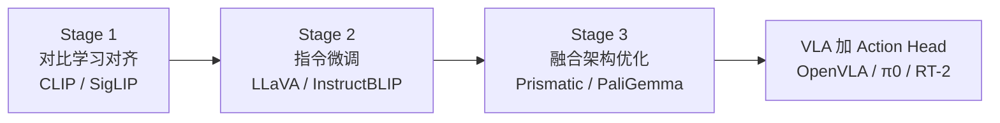

# VLM 视觉-语言模型 · 训练范式与阅读顺序

> **本文目标**：搞懂 VLM **怎么训**、**输入输出是什么**、**和 VLA 什么关系**；给出 **5 篇核心论文** 阅读顺序，PDF 见 `paper/VLA/VLM/`。  
> **读者**：已读 [VLA 训练与数据全貌（深度版）](../../VLA训练与数据全貌-深度版.md) Stage 0，想补 VLM 底座原理的同学。

---

## 一、VLM 是什么？和 VLA 的分工

| | **VLM** | **VLA** |
|--|---------|---------|
| **输入** | 图像 + 文本 | 图像 + 文本 +（可选）关节状态 |
| **输出** | **文本**（描述、答案、推理） | **动作**（连续向量或 token） |
| **训练数据** | 互联网图文对、VQA、Caption | 机器人 demo 轨迹 |
| **在流水线中的位置** | **Stage 0 底座**（通常直接下载权重） | Stage 1+ 在 VLM 上加 Action Head |

```text
互联网图文  ──→  VLM 预训练  ──→  冻结/LoRA 加载
                                        │
机器人 demo ──→  BC 训练 Action Head ──┘  →  VLA
```

**机器人团队通常不做 VLM 预训练**，但理解 VLM 训练三阶段，才能明白为什么 OpenVLA 冻结 SigLIP、RT-2 要 co-train web 数据。

---

## 二、VLM 训练三阶段（现代主线）



### Stage 1 · 视觉-语言对齐（Contrastive）

**目标**：让「图」和「文」在同一 embedding 空间里靠近。

| 项 | CLIP | SigLIP |
|----|------|--------|
| **输入** | 图像 batch + 匹配/不匹配 caption batch | 同左 |
| **Loss** | InfoNCE（softmax 对比） | **Sigmoid** 逐对二分类（更稳、可更大 batch） |
| **输出** | 图像 encoder + 文本 encoder | 同左；SigLIP 视觉塔更常用于 VLA |
| **数据** | 4 亿 WebImageText 等 | LAION 等大规模图文 |

**训练直觉**：正样本对（图-文匹配）相似度 ↑，负样本 ↓。训完以后，Vision Encoder 能产出「语义化」的视觉特征——OpenVLA / RDT / π0 的 SigLIP 都来自这一阶段。

📄 论文：[CLIP](../../paper/VLA/VLM/CLIP/CLIP-%20Learning%20Transferable%20Visual%20Models%20From%20Natural%20Language%20Supervision.pdf) · [SigLIP](../../paper/VLA/VLM/SigLIP/SigLIP-%20Sigmoid%20Loss%20for%20Language%20Image%20Pre-Training.pdf)

---

### Stage 2 · 视觉指令微调（Instruction Tuning）

**目标**：把「对齐好的视觉特征」接到 **LLM** 上，让模型能 **对话式** 回答关于图像的问题。

| 项 | 说明 |
|----|------|
| **输入** | 图像 + 用户指令（如 "Describe this image" / "What is left of the cup?"） |
| **输出** | 自然语言回复 |
| **架构** | Vision Encoder → **Projector（MLP）** → LLM token 序列 |
| **训练** | 只对 **回答部分** 算 next-token CE loss（prompt 部分 mask 掉） |
| **数据** | LLaVA-Instruct、ShareGPT4V 等（GPT-4 生成 QA 对） |

**关键设计**：
- 视觉 token 与文本 token **拼成一条序列**，LLM causal attention 统一处理
- 通常 **冻结 Vision Encoder**，只训 Projector + LLM（或 LoRA）

📄 论文：[LLaVA](../../paper/VLA/VLM/LLaVA/LLaVA-%20Visual%20Instruction%20Tuning.pdf)

---

### Stage 3 · 架构搜索与开放权重（VLA 直接用的底座）

在 Stage 1+2 成熟后，社区系统比较：**哪种 Vision Encoder、哪种 LLM、哪种 Projector** 组合最好——Prismatic / PaliGemma 是 VLA 时代的「开箱即用」底座。

| 模型 | 视觉 | 语言 | 特点 | VLA 使用者 |
|------|------|------|------|-----------|
| **Prismatic-7B** | SigLIP + DINOv2 双塔 concat | Llama 2 7B | 空间推理强 | **OpenVLA** |
| **PaliGemma** | SigLIP-So400m | Gemma-2B | 轻量、多任务 transfer | **π0** |
| **PaLI-X** | 大 ViT | 大 LLM | 闭源 SOTA | **RT-2** |
| **Qwen-VL** | ViT | Qwen | 中文友好 | Qwen-RobotManip, RDT2 |

📄 论文：[Prismatic VLMs](../../paper/VLA/VLM/Prismatic-VLM/Prismatic%20VLMs-%20Investigating%20the%20Design%20Space%20of%20Visually-Conditioned%20Language%20Models.pdf) · [PaliGemma](../../paper/VLA/VLM/PaliGemma/PaliGemma-%20A%20versatile%203B%20VLM%20for%20transfer.pdf)

---

## 三、一条样本在 VLM 里长什么样

### 预训练（对比学习）

```text
image_i  ──→ ViT ──→ v_i ∈ R^d
text_i   ──→ TextEncoder ──→ t_i ∈ R^d
Loss: -log( exp(sim(v_i,t_i)/τ) / Σ_j exp(sim(v_i,t_j)/τ) )
```

### 指令微调 / VLA 推理

```text
[IMG] → ViT → [v_1, v_2, ..., v_256]  视觉 token
[TXT] → Tokenizer → [w_1, w_2, ..., w_L]  文本 token

序列: [BOS] [v_1..v_256] [w_1..w_L] [ASSISTANT] [output tokens...]
Loss: 只对 output 部分 next-token CE
```

VLA 扩展：把 `[output tokens]` 换成 **action tokens**（RT-2/OpenVLA）或接 **独立 Flow/Diffusion Head**（π0/RDT）。

---

## 四、推荐阅读顺序（1–2 周）

| 序 | 优先级 | 论文 | arXiv | 读什么 | 搞懂什么 |
|:--:|:------:|------|-------|--------|---------|
| 1 | ⭐ | **CLIP** | 2103.00020 | §2–3 Method | 对比学习如何让图文对齐 |
| 2 | ⭐ | **SigLIP** | 2303.15343 | §2 Sigmoid Loss | 为何 VLA 多用 SigLIP 而非 CLIP |
| 3 | ⭐ | **LLaVA** | 2304.08485 | §3 Architecture + §4 Training | Vision→LLM 怎么接、指令微调怎么做 |
| 4 | ⭐ | **Prismatic VLMs** | 2402.07865 | §3 Design Space + Fig.6 | OpenVLA 底座为何 SigLIP+DINOv2 |
| 5 | ⭐ | **PaliGemma** | 2407.07726 | §2 Architecture + §3 Pretrain | π0 用的轻量 VLM 怎么训 |

**读完后接 VLA 主线**：[IL-Paradigms 概述](../IL-Paradigms/概述.md) Phase 4（RT-2 → OpenVLA → π0）。

---

## 五、和 VLA 训练策略的对照

| 策略 | 做法 | 谁用 | 原因 |
|------|------|------|------|
| **冻结 Vision Encoder** | 只训 Projector + Action Head | OpenVLA, π0, RDT | 省算力；防 catastrophic forgetting |
| **LoRA on LLM** | 低秩微调语言 backbone | OpenVLA finetune | 数据少时防过拟合 |
| **Co-train web VLM 数据** | batch 混 robot + 图文 QA | RT-2 | 保持语义能力 |
| **Full finetune VLM** | 全参数更新 | 数据多、算力足时 | 域差大（新相机、新语言） |

详见 [VLA 训练与数据全貌 · Stage 0–2](../../VLA训练与数据全貌-深度版.md#二现代-vla-训练六阶段逐步拆解)。

---

## 六、本地资源

| 类型 | 路径 |
|------|------|
| PDF 索引 | [`paper/论文索引.md`](../../paper/论文索引.md) → **0 · VLM 底座** |
| 目录说明 | [`paper/README.md`](../../paper/README.md) |
| PDF 目录 | `paper/VLA/VLM/`（VLM 是 VLA 的 Stage 0 子模块） |
| VLA 怎么用 VLM | [OpenVLA](../IL-Paradigms/OpenVLA.md) · [π0](../IL-Paradigms/Pi0-Flow-Matching-VLA.md) · [RT-2](../IL-Paradigms/RT-2-Vision-Language-Action.md) |
| 训练全景 | [VLA训练范式全景图](../../VLA训练范式全景图.md) |

---

## 自测

1. VLM 预训练（SigLIP）和 VLA 训练（BC）用的数据分别是什么？
2. 为什么 OpenVLA 用 SigLIP+DINOv2 双塔，而不是单 CLIP？
3. LLaVA 的 Projector 作用是什么？训练时 loss 算在哪一段 token 上？
4. 冻结 VLM vs RT-2 co-train，各解决什么问题？
